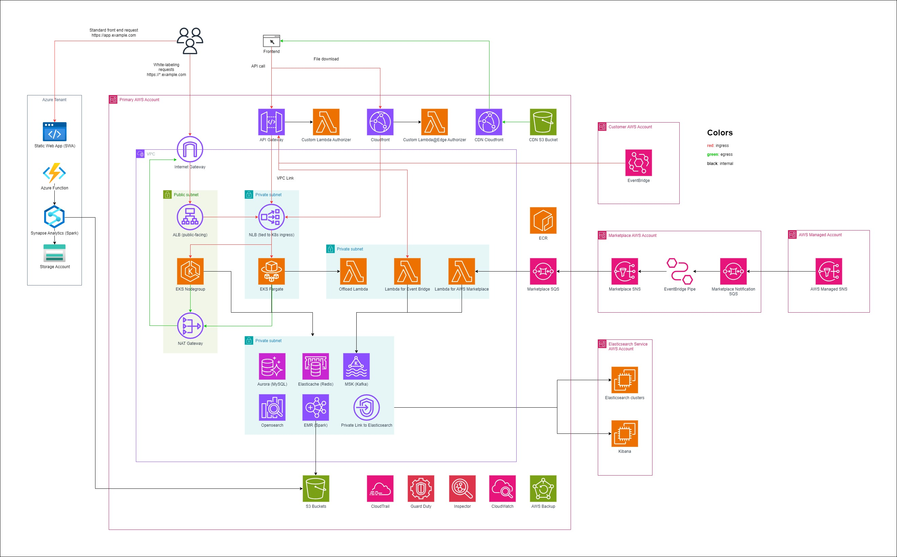
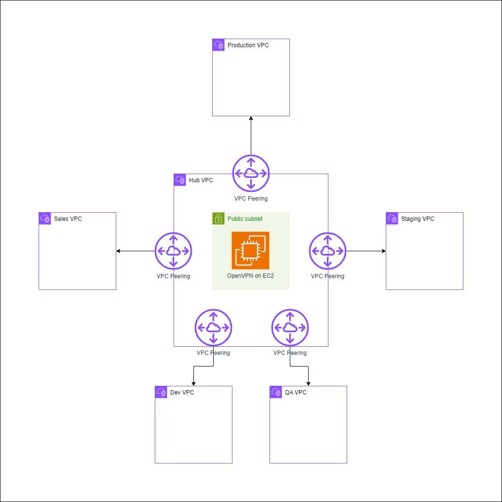
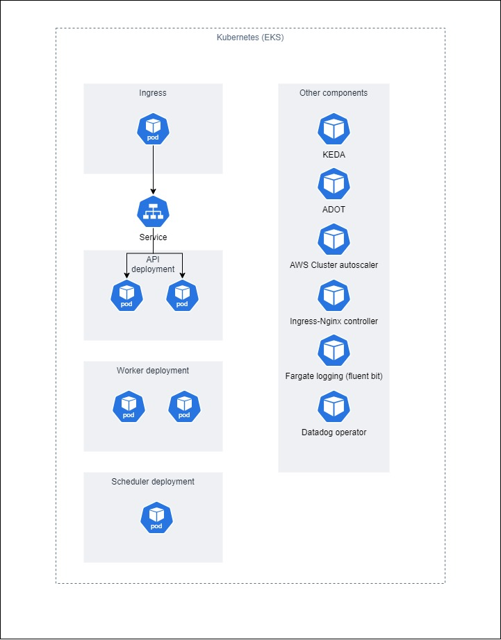

# SaaS Platform

This is a replica of the SaaS platform environment that I build from scratch for a company. Each environment resides in a different AWS account.

## Stacks
1. EKS (Kubernetes), with EKS Fargate and EKS Nodegroup
2. MSK (Kafka)
3. Elasticache (Redis)
4. Aurora (MySQL)
5. Opensearch
6. EMR Serverless (Apache Spark), initially EMR on EC2
7. API Gateway with custom Lambda Authorizer
8. Cloudfront with custom authorizer at Lambda@Edge
9. Internet Gateway and NAT Gateway
10. NLB and ALB
11. Lambda, EventBridge, SNS, SQS, S3
12. CloudTrail, CloudWatch
13. Guard Duty, Inspector
14. etc (refer to diagram)

## Diagram

Single environment

Peering

Kubernetes

## Design Consideration
Most resources are within private subnet in a Virtual Private Cloud (VPC) for security. 

Ingress traffic is managed by Application Load Balancer (ALB) and API Gateway (API GW). Egress is routed to NAT Gateway for its high performance and security (since ingress traffic will be blocked). 

Other security measure include Network ACL to block ingress SSH and RDP except for authorized IP. Country block to prevent unauthorized countries to login into our environment. No publicly exposed SSH and RDP port on security groups.

For VPN, we are using OpenVPN instances. Due to some resources have no built-in authentication mechanism or adding authentication requires significant code change and we have to prevent write to some resources due to compliance, we have two VPN instances, one for admin and one for developers.

We also have small Azure resources to meet requirements.

For high availability, we are using at least 2 Azs. For all resources, we use at least 2 instances. That includes API Kubernetes pods.

There's also Lambda function that complements Kubernetes pods for workload that requires higher concurrency.

Monitoring are done via Cloudwatch and Datadog. On EKS, we use ADOT and CloudWatch agent with container insight.

For disaster recovery, we backup our data daily to second region in AWS.

For cost reduction, we have reserved instances and savings plan. S3 has intelligent-tiering enabled.

CI/CD is configured in Azure DevOps.

Additional orchestration for Kubernetes is done using helm.

## Improvements
We used to have Transit Gateway, so we can create a hub-and-spoke architecture. But since we didn't grow further, I change Transit Gateway (paid) to VPC Peering (free) to save cost while still maintaining hub-and-spoke architecture.

Initially we use EMR on EC2, but we have so many jobs and EMR on EC2 can only handle 256 concurrent execution and most of the time, it is idle, so I did a PoC and managed to convince developers to switch to EMR serverless.

At one point, our Redis was struggling due to network bandwidth, so I asked developers to update the code to handle a read replica. We ended up with 2 Redis instances, one for read/write and one for read only.

API Gateway has 10 MB hard limit on request body and it doesn't work for us when customer wants to download files, so I ended up with Cloudfront and add custom authorizer written in Python (with pyJWT) running in Lambda@Edge because our software architect doesn't want to use S3 presigned url.

## Considered Improvements
We can host our frontend with S3 and CloudFront, but due to white-labeling and no cache requirements, I have to keep the frontend in Kubernetes pod running Node.js container.

Sadly, Web Application Firewall has be scrapped due to budget cut. If not, it will go in front of ALB and CloudFront.

If we have more employees, I would like to move from EKS Fargate to EKS Nodegroup. Just because scaling in EKS Nodegroup is faster but required more setup and maintenance. EKS Fargate is slow to scale due to it takes time for EKS to find node to host our pods, but at the same time, we don't have to worry about node scaling and patching the AMI.

There's also discussion in moving Elasticsearch to Opensearch, but it requires some critical code change.

Our GitOps is using a push method where it goes from version control and pushed to the environment. A consideration to use pull method such as CloudFormation Git sync and Flux CD or Argo CD for Kubernetes are considered but not implemented due to employee shortage.